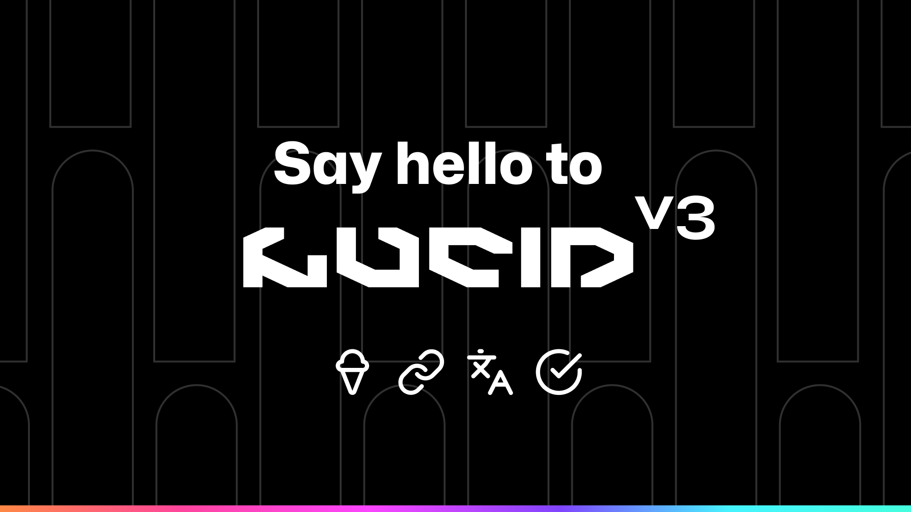

# Lucid Ui ✨

Checkout our [Website](https://omikron.me)



---

## How to install

1.  Install the package.
    ```shell
    bun i [package name] #pnpm for windows
    ```
1.  Install tailwind for vite using [this](https://tailwindcss.com/docs/guides/vite) guide.
1.  Add the present to your [tailwind.config.js]()
    ```javascript
    /** @type {import('tailwindcss').Config} \*/
    export default {
    content: ['./index.html', './src/**/\*.'],
    ...
        presents: [require('lucidui/tailwind')]
    ...
    ```
1.  Install sass(=scss).
    ```shell
    bun i sass-loader sass #pnpm for windows
    ```
1.  Add the styles to your global css file.
    ```css
    @import 'lucidui/styles';
    ```

## About

This UI toolkit is a proprietary product of Omikron Industries. It encapsulates the unique visual style that distinguishes all Omikron products. Designed with precision and a keen eye for aesthetics, this toolkit serves as the cornerstone for the user interface across our product range.

Our toolkit is not just about looks - it's about creating a consistent and engaging user experience. It ensures that all Omikron products have a uniform look and feel, promoting usability and enhancing user interaction.

Built by Omikron, for Omikron, this toolkit is a testament to our commitment to quality, consistency, and user-centric design.

## Notes

- Please note that this software is meant for internal use only.

---

## MIT License

### ©️ 2024 Omikron Industries.

Permission is hereby granted, free of charge, to any person obtaining a copy
of this software and associated documentation files (the "Software"), to deal
in the Software without restriction, including without limitation the rights
to use, copy, modify, merge, publish, distribute, sublicense, and/or sell
copies of the Software, and to permit persons to whom the Software is
furnished to do so, subject to the following conditions:

The above copyright notice and this permission notice shall be included in all
copies or substantial portions of the Software.

THE SOFTWARE IS PROVIDED "AS IS", WITHOUT WARRANTY OF ANY KIND, EXPRESS OR
IMPLIED, INCLUDING BUT NOT LIMITED TO THE WARRANTIES OF MERCHANTABILITY,
FITNESS FOR A PARTICULAR PURPOSE AND NONINFRINGEMENT. IN NO EVENT SHALL THE
AUTHORS OR COPYRIGHT HOLDERS BE LIABLE FOR ANY CLAIM, DAMAGES OR OTHER
LIABILITY, WHETHER IN AN ACTION OF CONTRACT, TORT OR OTHERWISE, ARISING FROM,
OUT OF OR IN CONNECTION WITH THE SOFTWARE OR THE USE OR OTHER DEALINGS IN THE
SOFTWARE.
